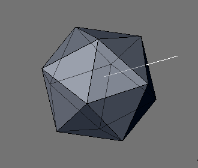
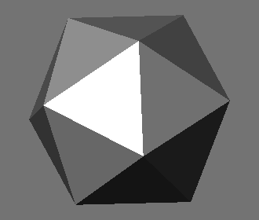
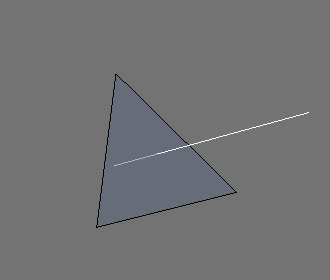

% collisionDetect2.c

---

### ptToTriMeshCollision()

Determines where or if a point collided from the inside or outside of a mesh.

Note: makeTriTransData() must be used first to create transformation data for each polygon.

Note: Each individual triangle will be normalized to test for a collision. This could cause the point to miss and go through the cracks of the triangles because each has to be rotated differently to be normalized. This is where the "errorMargin" variable might be useful, however ptToQuadMeshZCollision() could be used instead which does not have this problem.

  if errorMargin equals 0.001

Note: If testing for when a point is inside a mesh and the mesh has both quads and triangles then make sure to use both ptToTriMeshCollision() and ptToQuadMeshCollision(). If the "outside" variable is true in both cases then it is outside of the mesh.

---

### ptToQuadMeshCollision()

Determines where or if a point collided from the inside or outside of a mesh.

Note: makeQuadTransData() must be used first to create transformation data for each polygon.

Note: Each individual triangle will be normalized to test for a collision. This could cause the point to miss and go through the cracks of the triangles because each has to be rotated differently to be normalized. This is where the "errorMargin" variable might be useful, however ptToQuadMeshZCollision() could be used instead which does not have this problem.

Note: If testing for when a point is inside a mesh and the mesh has both quads and triangles then make sure to use both ptToTriMeshCollision() and ptToQuadMeshCollision(). If the "outside" variable is true in both cases then it is outside of the mesh.

---

### ptToTriCollision()

This function can be used to find where and what side of a triangle a point has collided.

---

### ptToTriMeshZCollision()

Can be used with getUCRotPointToAxisZ() to determine where or if a point collided from the inside or outside of a mesh.

Note: If testing for when a point is inside a mesh and the mesh has both quads and triangles then make sure to use both ptToTriMeshZCollision() and ptToQuadMeshZCollision(). If the "outside" variable is true in both cases then it is outside of the mesh.

---

### ptToQuadMeshZCollision()

Can be used with getUCRotPointToAxisZ() to determine where or if a point collided from the inside or outside of a mesh.

Note: If testing for when a point is inside a mesh and the mesh has both quads and triangles then make sure to use both ptToTriMeshZCollision() and ptToQuadMeshZCollision(). If the "outside" variable is true in both cases then it is outside of the mesh.

---

