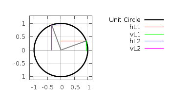
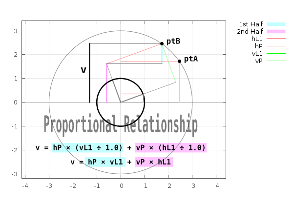

% rotate.c

---

### relativeRot()

Uses rotate() to rotate a point around a relative center.

---

### rotate()

Rotates a point around the x, y, and z axes concurrently.

 

For an example of how it rotates the x and y axes at the same time.

 

It will first rotate so that the slanted rotation will be around the x axis.

 

Then it will rotate the same amount of distance as if it were moving slanted.

 

Last it will rotate back to make the rotation slanted.

---

### degRot()

Rotates a point around an axis using degrees. This is slower than using ucRot().

---

### ucRot()

Rotates a point around an axis using unit circle coordinates.

Known lengths within similar triangles are used to find the vertical value of the rotated point.

The horizontal value is found the same way.

---

