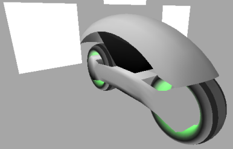

% Add Mesh

---

This howto will add a light cycle mesh in the 4th scene.

**In main.c**

---

**Add under the includes:**

~~~ {.c}
#include "meshes/lightCycle.h"
~~~

---

**In initialize.c**

---

**Find:**

~~~ {.c}
if (initializeScene4)
{
~~~

**And replace with:**

~~~ {.c}
if (initializeScene4)
{
   globalResize(&lightCycle_TRANS[0], lightCycle_MESHCNT, 0, 0, 0, 50, 50, 50);

   copyTransFromTo(&lightCycle_TRANS[0], &lightCycle_STATICTRANS[0], lightCycle_MESHCNT);
   copyMeshFromTo(&lightCycle_POINT[0], &lightCycle_POINTDATSZ[0], 0,
                  &lightCycle_STATICPOINT[0], &lightCycle_POINTDATSZ[0], 0, lightCycle_MESHCNT);
~~~

---

**In scene4.c**

---

**Find:**

~~~ {.c}
// reset mesh data for each frame
~~~

**And replace with:**

~~~ {.c}
// reset mesh data for each frame
copyMeshFromTo(&lightCycle_STATICPOINT[0], &lightCycle_POINTDATSZ[0], 0,
               &lightCycle_POINT[0], &lightCycle_POINTDATSZ[0], 0, lightCycle_MESHCNT);
~~~

---

**Find:**

~~~ {.c}
glDisable(GL_FOG);
~~~

**And replace with:**

~~~ {.c}
glDisable(GL_FOG);

// apply transformation data to the meshes
applyRotLocSz(&lightCycle_TRANS[0], &lightCycle_POINT[0], &lightCycle_POINTDATSZ[0], 0, lightCycle_MESHCNT);

// draw mesh
drawMesh(&lightCycle_POINT[0], &lightCycle_QUAD[0], &lightCycle_TRI[0], &lightCycle_VCOLOR[0],
         &lightCycle_TEX[0], &lightCycle_TEXCOORD[0], &lightCycle_TEXLINKDAT[0],
         &lightCycle_QUADDATSZ[0], &lightCycle_TRIDATSZ[0], &lightCycle_HIDE[0], 0, lightCycle_MESHCNT, rI);
~~~

---

---

The compiler needs to be told to compile the mesh data.

To compile with gcc:

**In Makefile.win**

---

**Find:**

~~~ {.c}
meshes/cubes.o
~~~

**And replace with:**

~~~ {.c}
meshes/cubes.o meshes/lightCycle.o
~~~

---

To compile with tcc:

**In tmake.bat**

---

**Find:**

~~~ {.c}
meshes\cubes.o
~~~

**And replace with:**

~~~ {.c}
meshes\cubes.o meshes\lightCycle.o 
~~~

---

**Find:**

~~~ {.c}
if NOT exist rsrc.res ..\..\tccAndTools\Gorc\Gorc.exe /r rsrc.rc
~~~

**And replace with:**

~~~ {.c}
if NOT exist meshes\lightCycle.o ..\..\tccAndTools\tcc\tcc.exe -c meshes\lightCycle.c -o meshes\lightCycle.o

if NOT exist rsrc.res ..\..\tccAndTools\Gorc\Gorc.exe /r rsrc.rc
~~~

---

Compile and run.

Press enter 4 times to see the results in the 4th scene.

---

---

To not draw the cubes mesh and to allow the mouse to rotate the light cycle

**In scene4.c**

---

**Find:**

~~~ {.c}
// draw mesh
drawMesh(&cubes_POINT[0], &cubes_QUAD[0], &cubes_TRI[0], &cubes_VCOLOR[0],
         &cubes_TEX[0], &cubes_TEXCOORD[0], &cubes_TEXLINKDAT[0],
         &cubes_QUADDATSZ[0], &cubes_TRIDATSZ[0], &cubes_HIDE[0], 0, cubes_MESHCNT, rI);

cubes_HIDE[cubes_plane] = FALSE;
~~~

**And replace with:**

~~~ {.c}
/*
// draw mesh
drawMesh(&cubes_POINT[0], &cubes_QUAD[0], &cubes_TRI[0], &cubes_VCOLOR[0],
         &cubes_TEX[0], &cubes_TEXCOORD[0], &cubes_TEXLINKDAT[0],
         &cubes_QUADDATSZ[0], &cubes_TRIDATSZ[0], &cubes_HIDE[0], 0, cubes_MESHCNT, rI);

cubes_HIDE[cubes_plane] = FALSE;
*/
~~~

---

**Find:**

~~~ {.c}
if (leftMouseDown)
{
~~~

**And replace with:**

~~~ {.c}
if (leftMouseDown)
{
   globalConcurrentAxisRot(&lightCycle_TRANS[0], lightCycle_MESHCNT, 0, 0, 0, -yDragLgth, -xDragLgth, 0);
~~~

---

Compile and run.

Press enter 4 times to see the results in the 4th scene.

---

---

