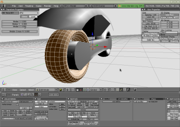
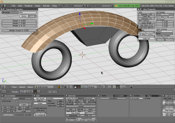
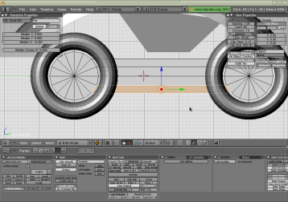
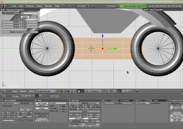
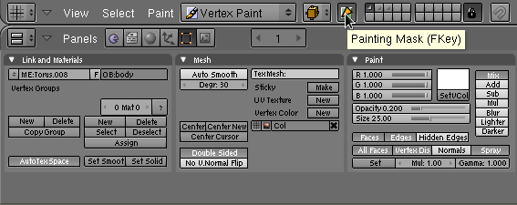
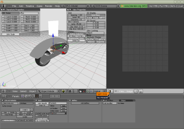

% Blender

These howtos are for blender 2.49b.

---

### Mesh Modeling
##### Start blender and erase everything:
Move the mouse cursor into the "3D View" window  
Press 'A' to select everything  
Press 'X' and click to confirm  
Click "File" -> "Save As..." and save as "lightCycle.blend"  
Remember to save throughout and to save often  

##### Move the cursor to center:
Get the "View Properties" window by clicking "View" then "View Properties..."  
In the "View Properties" window move the 3D cursor to location 0.0, 0.0, 0.0 by clicking the center of each coordinate number and typing 0  

##### Add a mesh:
Make sure the the "3D View" window is in orthographic mode by clicking "View" then "Orthographic"  
Press 'Spacebar'  
Goto "Add" -> "Mesh" and click "Torus"  
Press 'N' to reveal the "Transform Properties" window  

##### Create the wheels:
Make sure the torus is highlighted  
In the "Transform Properties" window change "ScaleZ" to 2.000  
Go into edit mode by pressing 'Tab'  
Rotate the torus 90 degrees by pressing 'R' then 'Y' for the axis and enter in 90  
Press 'Tab' again to exit edit mode and go into object mode  
Change to side view by clicking "View" then "Side"  
In the "Transform Properties" window change "LocY" to -2.000  
In the "Transform Properties" window change "OB" to "backWheel"  
Hold 'Shift' and press 'D' to duplicate the object  
Right click to return the duplicated object  
Move the duplicated object by changing "LocY" to 3.000 in the "Transform Properties" window  
In the "Transform Properties" window change "OB" to "frontWheel"  

##### Create the shell of the body:
In the "View Properties" window move the 3D cursor to location 0.0, 0.0, 0.0  
Click "Add" -> "Mesh" and click "Torus"  
Go into edit mode by pressing 'Tab'  
Rotate the torus 90 degrees by pressing 'R' then 'Y' for the axis and enter in 90  
Press 'S' and enter in 4 to resize the torus  
Hold 'Ctrl' and press tab and select "Vertices" for vertex select mode  
Press 'Z' to make hidden vertices selectable  
Press 'B' and drag the mouse to select vertices  
Press 'X' and click "Vertices" to erase unwanted geometry to create a top shell  
Right clicking can also be used to select vertices  
Hold 'Ctrl' and press tab and select "Edges" for edge select mode  
Hold 'Shift' and select two edges at the corner and press 'F' to create a face  
Repeat for each corner of the shell  
Use 'S' and 'G' to size and move the shell how you want it on top of the wheels  

##### Create the rest of the body:
In the "View Properties" window move the 3D cursor to location 0.0, 0.0, 0.0  
While still in edit mode click "Add" -> "Mesh" and click "Cube"  
Right click select the top edges of the cube and press 'X' and click "Only Faces"  
While the top edges are selected press 'S' and enter in 1.5  
Hold 'Ctrl' and press 'L' to selected connected vertices
Press 'S' and enter in 0.6  
Hold 'Ctrl' and press tab and select "Vertices" for vertex select mode  
Click "View" then "Side" to help position vertices  
Use 'B' to select and position each corner how you want it under the shell  
Press 'Tab' to exit edit mode and go into object mode  
In the "Transform Properties" window change "OB" to "body"  

##### Create the bottom frame:
In the "View Properties" window move the 3D cursor to location 0.0, 0.0, 0.0  
Click "Add" -> "Mesh" and click "Circle"  
In the "Add Circle" window type 16 for "Vertices", 0.7 for "Radius", and enable "Fill"  
Go into edit mode by pressing 'Tab'  
Rotate the circle 90 degrees by pressing 'R' then 'Y' for the axis and enter in 90  
In the "Transform Properties" window change "LocY" to -2.000  
Hold 'Shift' and press 'D' to duplicate the mesh  
Right click to return the duplicated mesh  
Move the duplicated mesh by changing "LocY" to 3.000 in the "Transform Properties" window  
Hold 'Ctrl' and press tab and select "Edges" for edge select mode  
Right click to highlight and use 'F' to connect the closest 4 edges of each circle  
Press 'A' 1 or 2 times to have nothing selected  
Use 'B' to select the 5 connected lines  
Press 'W' and in the "Specials" window click "Subdivide Multi", use 3 for "Number of Cuts"  
Hold 'Ctrl' and press tab and select "Vertices" for vertex select mode  

 

Select everything except the outer edges and center vertex of each circle  
Press 'W' and in the "Specials" window click "Smooth" and repeat  
Press 'A' 2 times to select all  
In the "Transform Properties" window change "LocX" to 0.600  
Press 'E' and in the "Extrude" window click "Region"  
Right click to return the duplicated mesh  
In the "Transform Properties" window change "LocX" to -0.600  
Hold 'Ctrl' and press tab and select "Edges" for edge select mode  
Select an edge near the hubs connected to a face a wheel goes through, press 'X' and click "Edges", repeat 3 more times  
Hold 'Ctrl' and press tab and select "Vertices" for vertex select mode  
Select all vertices between the wheels  
Press 'S' then 'X' and enter in 0.75 to resize the center of the frame  
Press 'Tab' to exit edit mode and go into object mode  
In the "Transform Properties" window change "OB" to "frame"  

##### Create an indicator sign:
In the "View Properties" window move the 3D cursor to location 0.0, 0.0, 4.0  
Click "Add" -> "Mesh" and click "Plane"  
Go into edit mode by pressing 'Tab'  
Rotate the circle 90 degrees by pressing 'R' then 'X' for the axis and enter in 90  
Press 'Tab' to exit edit mode and go into object mode  
In the "Transform Properties" window change "OB" to "sign"  

---

### Color Using Vertex Paint
##### Recalculate normals outside:
Open "lightCycle.blend"  
Select the "body" while in object mode  
Go into edit mode by pressing 'Tab'  
Press 'D' and click "Texture Solid" to differentiate the inside of faces from the outside  
Press 'A' 1 or 2 times to select all  
Hold 'Ctrl', press 'N' and click "Recalculate normals outside"  
Repeat this process for all objects  
Note: To recalculate normals inside hold 'Ctrl', 'Shift' and press 'N'  

##### Using Vertex Paint:
Change where it say's "Object Mode" to "Vertex Paint"  
Press 'F' to enable or disable the painting mask  
Press 'F9' to view paint controls in the "Buttons Window"  
Press 'N' to hide or reveal the "Paint Properties"  
With the painting mask enabled select a color, select what to paint and click "SetVCol"  
Use 'Tab' to get in and out of edit mode for better selecting options  
Change where it say's "Vertex Paint" back to "Object Mode" to switch to a different object  

---

### Color Using Colors From Texture
Note: You will need texture_to_vcol.py (a "Bake Texture to VColor" python script)  

##### Prepare the environment:
Open "lightCycle.blend"  
Right click between the "3D View" and "Buttons Window" windows and click "Split Area"  
Use about half the "3D View" window and change the window on the right to "UV/Image Editor"  

##### Prepare the mesh:
Make sure normals are flipped the right way first  
Press 'D' and click "OpenGL Solid"  
Select the "body" while in object mode  
Go into edit mode by pressing 'Tab'  
Press 'A' 1 or 2 times to select all  
Press 'F9' and in "Link and Materials" click "Set Smoot"  
Repeat for all objects  

##### Use texture to assign vertex color:
Press 'D' and click "Textured Solid"  
Select the "body" while in object mode  
Go into edit mode by pressing 'Tab'  
Press 'A' 1 or 2 times to select all  
Press 'U' and click "Unwrap"  
In the "UV/Image Editor" window click "Image" -> "New..." then "OK"  
Click "Image" -> "Texture Painting"  
Click "View" -> "Paint Tool..."  
In the "3D View" press 'Tab' then 'V' to get to vertex paint mode  
Click "Paint" -> "Bake Texture to VColor..." (a python script)  
In the "3D View" press 'V' then 'Tab' to get to edit mode  
In the "UV/Image Editor" click the "X" next to the datablock name  
In the "3D View" press 'Tab' to get back to object mode  

##### Vertex coloring using light sources:
Press 'D' and click "Textured Solid"  
Select the "body" while in object mode  
Go into edit mode by pressing 'Tab'  
Press 'A' 1 or 2 times to select all  
Press 'U' and click "Unwrap"  
Sometimes "Lightmap UVPack" might be a better choice  
If using "Lightmap UVPack" choose 48 for "Pack Quality" and 1.000 for "Margin"  
In the "UV/Image Editor" window click "Image" -> "New..." then "OK"  
Press 'Tab' for object mode  
Click "Add" -> "Lamp" and click "Lamp"  
Move the lamp where ever you want it  
Press 'F5' while the lamp is selected  
In the shading panel change the type, color, and energy how you want  
Use as many lamps as you need  
Press 'F10' and click the "Bake" tab  
Select the "body" in the "3D View" window  
With "Full Render" selected click "BAKE"  
In the "3D View" press 'V' to get to vertex paint mode  
Click "Paint" -> "Bake Texture to VColor..." (a python script)  
In the "3D View" press 'V' then 'Tab' to get to edit mode  
In the "UV/Image Editor" click the "X" next to the datablock name  
In the "3D View" press 'Tab' to get back to object mode  

---

### Adding Texture to Mesh
Open "lightCycle.blend"  
Right click between the "3D View" and "Buttons Window" windows and click "Split Area"  
Use about half the "3D View" window and change the window on the right to "UV/Image Editor"  
Select the "sign" while in object mode  
Hold 'Shift' and press 'D' to duplicate the object  
Place the object where it can be easily distinguished from the other objects  
Duplicate the "sign" object 3 more times  

Press 'D' and click "Textured Solid"  
Select the "body" while in object mode  
Go into edit mode by pressing 'Tab'  
Press 'A' 1 or 2 times to select all  
Press 'U' and click "Unwrap"  
In the "UV/Image Editor" window click "Image" -> "Open..."  
Locate "cityGlare.bmp" in the texture folder  
Press 'B' to select and use 'S' and 'G' to size and move the outline how you want over the texture  
Repeat this process for the "frame" object  

Add "green.bmp" to the "sign" object  
Add "noise1.bmp" to the "sign.001" object  
Add "noise2.bmp" to the "sign.002" object  
Add "noise3.bmp" to the "sign.003" object  
Add "red.bmp" to the "sign.004" object  

In the "UV/Image Editor" window click "Image" -> "Consolidate into one image"  
Use 512 for "Pixel Size"  
Use 2 for "Pixel Margin"  
Click "All Sel Objects" and "OK"  
In the "UV/Image Editor" window click "Image" -> "Save As..."  
Save image as "lightCycle.bmp" make sure to choose the "BMP" option  
In the "UV/Image Editor" window click "Image" -> "Replace..." and choose "lightCycle.bmp"  

##### Creating a mask:
Using "lightCycle.bmp" as a template, open it with an image editor  
Anything painted with black is hidden  
Anything painted with white is visible  
Save as "lightCycleMask.bmp"  

---

### CAGE Import / Export
Note: You will need c_exportTex.py and c_importTex.py  

##### Export a scene:
Open "lightCycle.blend"  
Goto "File" -> "Export" -> "C code tex (.c)..."  

##### Import a scene:
Goto "File" -> "Import" -> "C code tex (.c)..."  
Choose a compatible c file  

---

